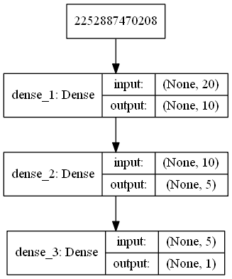

# seams2019-smartspread-ml

Smart spread algorithm is a VM selection algorithm that is used to deploy new container in serverless computing platforms. This repository contains the dataset and machine learning model used in our methodology. Take a look at our self-explanatory [jupyter notebook](PredictionTP.ipynb).

# Neural Network Architecture:

# More Information:
For more information, visit our [main repository](https://github.com/DDSystemLab/seams2019-smartspread).

## Configurations
  * Operating system -- Ubuntu 18.04
  * Python 3.6
  * Scikit Learn 0.20
  * Keras 2.2
